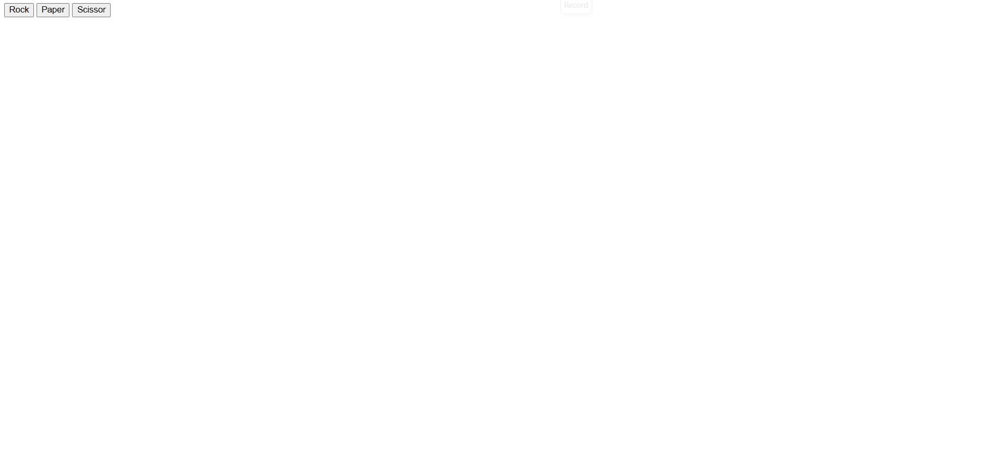

# Rock Paper Scissor



This program is an odinproject activity

Link: https://www.theodinproject.com/lessons/foundations-rock-paper-scissors

This project was played through the browser's console

It is now updated to be played with a UI
It is a simple game of rock, paper, scissor where your opponent is a computer

The game ends when the maximum point is reached which is 5

## Installation
1. Clone the repo
    ```sh
   git clone https://github.com/END1502/rock-paper-scissors.git
   ```
2. Open the index.html

## Built with
* html
* JavaScript

## Contributing

1. Fork it (<https://github.com/END1502/rock-paper-scissors.git>)
2. Create your feature branch (`git checkout -b feature/fooBar`)
3. Commit your changes (`git commit -am 'Add some fooBar'`)
4. Push to the branch (`git push origin feature/fooBar`)
5. Create a new Pull Request
